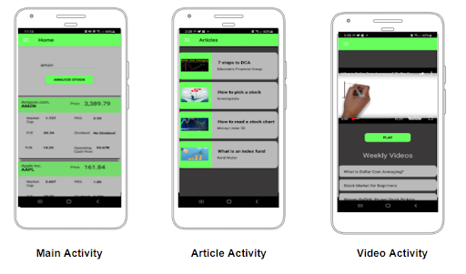

# SimpleStocks

SimpleStocks is an Android application which allows new investors to easily track their favourite stocks.

The Main Activity is used to track stocks and learn about stock metrics.
Stock metrics can be clicked to view a detailed explanation.

The Article Activity contains educational articles about investing.

The Video Activity contains a youtube player with a playlist of investing videos.

